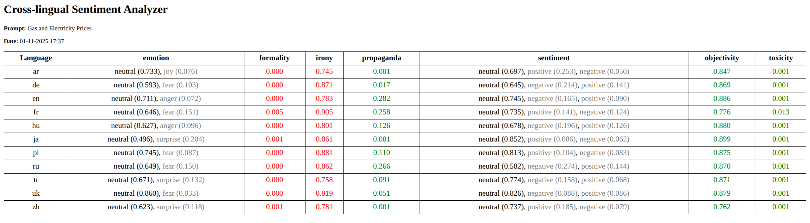
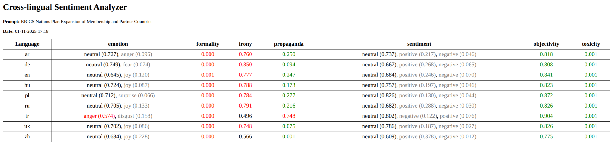

# CLSA: Cross-lingual Sentiment Analyzer

**Cross-lingual Sentiment Analyzer** is a civic tech type application: a multilingual media analysis tool designed to collect, translate, and analyze news articles across different countries and languages. Users provide a topic or keywords (e.g., “2024 US Presidential Election” or “2024 Olympics”) and select languages or regions (PL, ZH, US, RU, DE, etc.).

## Output
Example prompt:
```bash
python run_clsa.py -t "Gas and Electricity Prices" -l en,pl,zh,ru,uk,tr,de,fr,ja,ar,hu -a 10
```
Output as `output/clsa_results_Gas-and-Electricity-Prices.html` file:
<p align="center">
  
  <br><em>Gas & Energy Prices</em>
</p>
Or another topic:

```bash
python run_clsa.py -t "BRICS Nations Plan Expansion of Membership and Partner Countries" -l en,pl,zh,ru,ar,de,hu,tr,uk -a 10
```
<p align="center">
  
  <br><em>BRICS Nations Plan Expansion of Membership and Partner Countries</em>
</p>

## Setup and Usage
First, you need to download the appropriate models to the `models` folder.

```bash
mkdir -p models/translation models/encoders

cd models/translation
git clone https://huggingface.co/facebook/m2m100_418M

cd ../encoders
git clone https://huggingface.co/cardiffnlp/twitter-roberta-base-sentiment-latest
git clone https://huggingface.co/unitary/toxic-bert
git clone https://huggingface.co/j-hartmann/emotion-english-distilroberta-base
git clone https://huggingface.co/cardiffnlp/twitter-roberta-base-irony
git clone https://huggingface.co/cointegrated/roberta-base-formality
git clone https://huggingface.co/IDA-SERICS/PropagandaDetection

cd ../..
```

To run graph use command below:
```bash
python run_clsa.py -t "<YOUR_TOPIC_HERE>" -l <LANGUAGE_CODES_COMMA_SEPARATED> -a <NUM_ARTICLES_PER_LANGUAGE>
```
Flags:
- t - topic
- l - languages (comma-separated)
- a - number of articles per language

A list of all available languages can be found here: [Translation model languages](https://huggingface.co/facebook/m2m100_418M)

## Architecture

```plain
Architecture:

             +-----------------+
             |   input_text    |   (1x1)
             +--------+--------+
                      |
                      v
             +-----------------------+
             | translate_to_many     |   (1xL)
             +--------+--------------+
                      |
        -----------------------------------------
        |                 |                     |
   +---------+       +---------+           +---------+
   | scrape_ar|       | scrape_de|  ...    | scrape_zh|   (each node creates 1xA)
   +----+----+       +----+----+           +----+----+
        |                 |                     |
        v                 v                     v
   +---------------------------------------------+
   | translate_articles_to_english              |  (creates LxA matrix)
   +----------------+----------------------------+
                    |
    ---------------------------------------------
    |        |         |         |         |     |
+----------+ +----------+ +----------+ ... +----------+   (M models)
| sentiment| | toxic_bert| | emotion  |     | propaganda|
+----------+ +----------+ +----------+     +----------+
    \          \           \                  /
     -----------------------------------------
                      |
             +--------+--------+
             | save_final_state |
             +--------+--------+
                      |
             +--------+--------+
             | display_results |
             +--------+--------+
                      |
                     END
```
Legend / Explanation:
- L – number of languages (initial_state["selected_languages"])
- A – number of articles collected per language (num_articles)
- M – number of analysis models (sentiment, toxic, emotion, irony, formality, subjectivity, propaganda)
- Nodes like scrape_{lang} work in parallel (producing 1xA each), then merged in translate_articles_to_english (LxA).
- Analysis nodes are linear in the current graph, producing MxLxA output.
- Final nodes aggregate and display results.

⚠️ **Disclaimer**   
This code is provided for educational purposes only.
Use it responsibly and respect each website's Terms of Service.
The author does not condone mass scraping, data redistribution, or any violation of website policies.

## License

CLSA is released under the MIT license.

## Author

Sebastian Brzustowicz &lt;Se.Brzustowicz@gmail.com&gt;